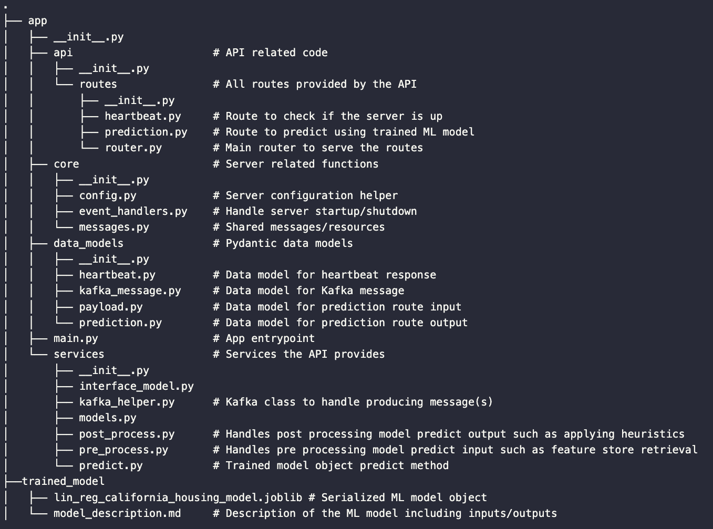

# ML Model API Scaffolding

Serving machine learning models production-ready, fast, easy and secure powered by FastAPI by [Sebastián Ramírez](https://github.com/tiangolo).

This directory contains a starter ML API which can be used to speed-up your next machine learning project. 

To experiment and get a feeling on how to use this scaffolding, a sample regression model for house price prediction is included in this project. Follow the installation and setup instructions to run the sample model and serve it as a RESTful API.

## Maintainer(s)
 - @Jason
 - @AdamH
 - @damon

## Requirements
Python 3.8+

## Installation
Install the required packages in your local environment (ideally virtualenv, conda, etc.).
```bash
pip install -r requirements
``` 

## Setup
There is a Makefile provided to _make_ your life easier. Simply run ```make setup```

## Local API testing

Launch the API locally via `docker compose up serve_model -d`

Check the API running by opening a browser and going to `http://localhost:3000/docs` to access the swagger documentation
   
You can use the sample payload from the `docs/sample_payload.json` file when trying out the house price prediction model using the API.


## API Project Structure



### Testing

#### Unit testing

All unit tests are in the tests directory. They can be run locally with `make test` or in docker using `docker compose up unit-tests`.


### Environments

Set the environment variable `APP_ENV` to one of the following names (all lower case).

| Name        | Description       |
|-------------|-------------------|
| development | Local development |
| testing     | Unit testing      |
| staging     | Pre-prod          |
| production  | Production        |

### Updating an Existing Repo

- Update `.drone.yml` based on template
- Add `Makefile` based on template
- Run `poetry init` to create `pyproject.toml`, or copy existing file from the template and change the project and version name
- Add needed dependencies to `pyproject.toml` under `[tool.poetry.dependencies]`
	- run pipreqs --print to see the deps needed, copy just the names
	- for the dep names copied, cross reference an existing `requirements.txt` file to get the correct versions
- copy everything from the template from `[tool.poetry.dev-dependencies]` down and add it into the pyproject toml file
- copy `setup.cfg` file from the template
- remove anything from `[tool.poetry.dependencies]` that exists already in `[tool.poetry.dependencies]`
- run `poetry lock` to create the lock file
- the `pyproject.toml` should use semantic versioning (semvar) for easy upgrading, e.g. `"pytest" = "^6.2.1"`
- run `make setup`
- If any of the dependencies fail on `poetry install`, add the needed dependency in the `pyproject.toml` file, remove the existing `poetry.lock` file and run `make setup.uninstall` then `make setup` again
- run `make format` to take care of any linting
- run `make deploy.requirements` to create/update `requirements.txt` and `requirements-dev.txt`
- push the PR!
