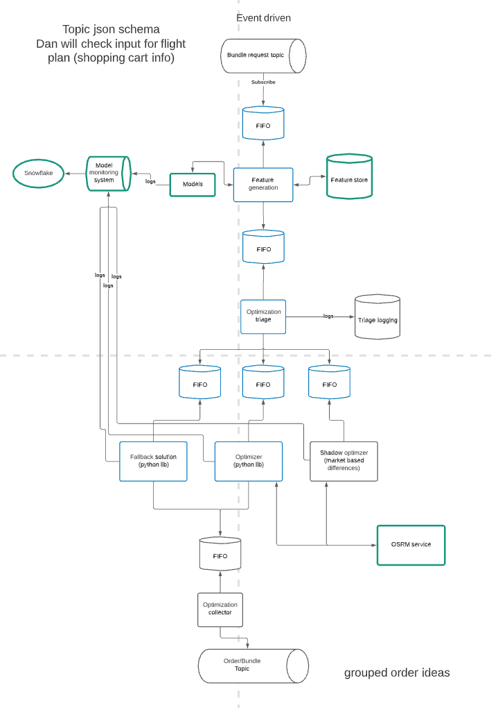

# ML Bundle Engine
The ML bundle engine is an event driven series of processes & queues. 
The engine intakes a Kafka message from the bundle request topic, makes a prediction with an ML model, runs an optimizer and outputs to a Kafka topic.



## Maintainer(s)
 - @Jason
 - @AdamH

## Run locally
Acquire creds to pypi.shipt.com #ask-machine-learning

Add these to your shell

```bash
export POETRY_HTTP_BASIC_SHIPT_USERNAME=your_username
export POETRY_HTTP_BASIC_SHIPT_PASSWORD=your_password
```

`docker-compose up`

- dummy_events: components/dummy_events.py - produces dummy kafka messages to an `input-topic` kafka
- features: components/feature_generator.py - reads from `input-topic` kafka, publishes to `triage` queue
- triage: components/triage.py - reads from `triage` queue, publishes to `optimizer` queue
- optimizer: components/optimizer.py - reads from `optimizer` queue, publishes to `collector` queue
- collector: components/collector.py - reads from `collector` queue and publishes to `output-topic` kafka
- dummy_consumer: components/dummy_consimer.py - reads from `output-topic` kafka and logs to stddout

# TODO
- create components for fallback, shadow optimizer
- get mock tests in place for Redis and Kafka messaging, write docstrings/fix pylint
- handle configuration for topic/queue names - publishers should have ability to publish dynamtically
- add correct input schema to whats published by dummy_producer
- kubedashian workers dont seem to allow passing in env vars - so we'll need to handle input/output queue names separately (config files?)