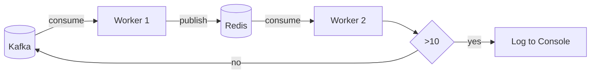

Documentation: https://shipt.github.io/py-volley/

Volley makes building event stream applications easier and more accessible. Use Volley if you need to quickly develop an application to consume messages, processes them (and do other things), then publish results to one or many places. Volley was inspired ease of use and developer experience provided by the [Flask](https://github.com/pallets/flask) and [FastAPI](https://github.com/tiangolo/fastapi) projects, and aims to make working with queue based and event driven system as accessible as REST APIs.

Volley handles a number of operations that need to happen before and after processing a message. Reading the data, serialization, data validation, all need to happen before data reaches your application. If these fail, Volley can route the message to a dead-letter-queue. After processing, Volley again handles data validation, serialization, and the writing/publishing of data to any number of output queues. Finally, upon successfully delivery of that message to the target queue, Volley handles marking it as read or deleting it from the input queue.

All of Volley's major operations (connectors, serializers, data validation/model handling) can be extended with plugins, and comes with built in support for queues-like technologies [Apache Kafka](https://kafka.apache.org/) and [RSMQ](https://github.com/mlasevich/PyRSMQ) (Redis Simple Message Queue). There is a plugin built for a Postgres queue in our [examples](./example/plugins/my_plugin.py).


[](https://drone.shipt.com/shipt/py-volley)
[](https://sonarqube.shipt.com/dashboard?id=shipt_py-volley_AYImTs5MsYUjTdFQ7Awt)

# Installation

Requires Python >= 3.8

```bash
pip install py-volley[all]
```

You can also limit the dependencies by:
```bash
pip install py-volley[kafka]  # Kafka dependencies
pip install py-volley[rsmq]  # RSMQ dependencies
pip install py-volley[zmq]  # ZeroMQ dependencies
```

## Features
- Built in support for [Apache Kafka](https://kafka.apache.org/), [RSMQ](https://github.com/smrchy/rsmq), [ZeroMQ](https://zeromq.org/)
- [Prometheus](https://prometheus.io/) metrics for all operations such as function processing time, and consumption and production count.
- Serialization in JSON and [MessagePack](https://msgpack.org/index.html)
- Data validation via [Pydantic](https://pydantic-docs.helpmanual.io/)
- Optionally configured integration with dead-letter-queues
- Extendible connectors (consumer/producers), serializers, model handlers, and model handlers via plugins.

## Getting started

Volley handles the process of consuming/producing by providing developers with extendible interfaces and handlers:
- connectors - consumer and producer interfaces which define how the application should read messages, write messages, and what actions to take when a message is successfully or fails processing.
- serializers - handlers and interface which describe the behavior for reading an byte objects from connectors. For example, Json or MessagePack serializers.
- model_handler - handler and interface which works very closely with serializers. Typically used to turn serialized data into a structured Python data model. Pydantic is Volley's most supported data_model and can handler serialization itself.
- data_model - When your application receives data from a queue, what schema and object do you expect it in? The data_model is provided by the user. And the `model_handler` describes how to construct your `data_model`.


To demonstrate, let's create an application with two worker nodes. One consumes from Kafka, finds the maximum value in a list then publishes it to Redis. The other consumes the message from Redis - if the max value is > 10, it logs to console otherwise it constructs a new list and publishes to the same Kafka topic. 



You can skip the details and just run `make intro.start`, which runs this example through `./example/intro/docker-compose.yml`

1. start Kafka and Redis instance

```
docker run -d -p 6379:6379 redis:5.0.0
docker run -d -p 9092:9092 bashj79/kafka-kraft
```

2. Configure the queues and data models. Let's put this in `./my_config.py`.

```python
# ./my_config.py
from typing import List, Tuple
from pydantic import BaseModel

from volley import Engine, QueueConfig

# define the schemas for the first and second worker nodes.
class InputMessage(BaseModel):
  my_values: List[float]

class OutputMessage(BaseModel):
  the_max: float

# define the configurations for the two queues, one in Kafka and the other in Redis.
queue_config = [
  QueueConfig(
    name="my-kafka-input",
    value="my.kafka.topic.name",
    profile="confluent",
    data_model=InputMessage,
    config={
      "group.id": "my.consumer.group",
      "bootstrap.servers": "localhost:9092",
    }
  ),
  QueueConfig(
    name="my-redis-output",
    value="my.redis.output.queue.name",
    profile="rsmq",
    data_model=OutputMessage,
    config={
      "host": "localhost",
      "port": 6379,
    }
  )
]
```

3. Build the first worker node - consume from Kafka, find the max value, publish to Redis

```python
# ./app_0.py
from typing import List, Tuple
from volley import Engine

from my_config import queue_config, InputMessage, OutputMessage
# the first node - reads from kafka and writes to redis
app_0 = Engine(
  app_name="app_0",
  input_queue="my-kafka-input",  # one input
  output_queues=["my-redis-output"],  # zero to many outputs
  queue_config=queue_config
)

@app_0.stream_app
def kafka_to_redis(msg: InputMessage) -> List[Tuple[str, OutputMessage]]:
  print(f"Received {msg.json()}")
  max_val = max(msg.my_values)
  out = OutputMessage(the_max=max_val)
  print(out)
  return [("my-redis-output", out)]  # a list of one or many output targets and messages

if __name__ == "__main__":
  kafka_to_redis()

```

4. Run the first application in a terminal
```bash
python app_0.py
```


5. Build the second worker node - consume from Redis, determine if we log to console or recycle the message as a new list.
```python
# ./app_1.py
from typing import List, Tuple, Union
from volley import Engine

from my_config import OutputMessage, queue_config, InputMessage

# the second node
app_1 = Engine(
  app_name="app_1",
  input_queue="my-redis-output",
  output_queues=["my-kafka-input"],
  queue_config=queue_config,
  metrics_port=None
)

@app_1.stream_app
def redis_to_kafka(msg: OutputMessage) -> Union[bool, List[Tuple[str, InputMessage]]]:
  print(f"The maximum: {msg.the_max}")
  if msg.the_max > 10:
    print("That's it, we are done!")
    return True
  else:
    out = InputMessage(my_values=[msg.the_max, msg.the_max+1, msg.the_max+2])
    return [("my-kafka-input", out)]  # a list of one or many output targets and messages

if __name__ == "__main__":
    redis_to_kafka()
```

6. Run the second worker node in another terminal
```bash
python app_1.py
```

7. Finally, let's manually publish a message to the input kafka topic:
```python
from confluent_kafka import Producer
import json
producer = Producer({"bootstrap.servers": "localhost:9092"})
producer.produce(topic="my.kafka.topic.name", value=json.dumps({"my_values":[1,2,3]}))
producer.flush(5)
```

You should see the following in your two terminals

__./app_0.py__
```
Received {"my_values": [1.0, 2.0, 3.0]}
the_max=3.0
Received {"my_values": [3.0, 4.0, 5.0]}
the_max=5.0
Received {"my_values": [5.0, 6.0, 7.0]}
the_max=7.0
Received {"my_values": [7.0, 8.0, 9.0]}
the_max=9.0
Received {"my_values": [9.0, 10.0, 11.0]}
the_max=11.0
```

__./app_1.py__
```
The maximum: 3.0
The maximum: 5.0
The maximum: 7.0
The maximum: 9.0
The maximum: 11.0
That's it, we are done!
```

# Complete example

Clone this repo and `make run.example` to see a complete example of:
- consuming a message from a Kafka topic
- producing to RSMQ
- consuming from RSMQ and publishing to Kafka and Postgres using custom plugin for Postgres.

# Contributing

See our [contributing guide](./CONTRIBUTING.md).

Thanks goes to great [projects](./ATTRIBUTIONS.md) and these incredible people.

<a href="https://github.com/shipt/py-volley/graphs/contributors">
  
</a>
